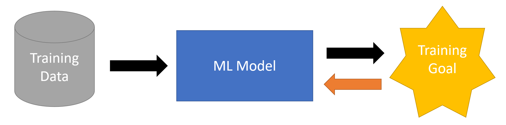
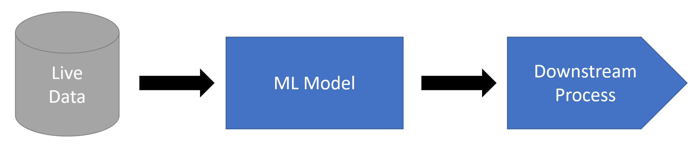
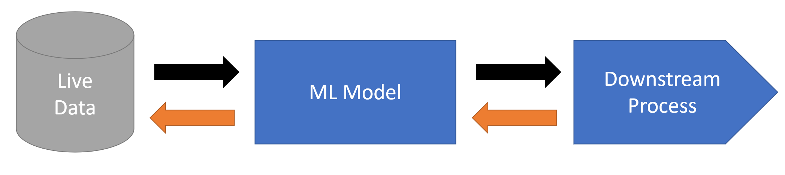

# Swergio

Python package to facilitate communication between independent ML components via WebSocket.

Full documentation for the swergio project can be found at https://swergio.github.io.

## Motivation

Machine learning and data science models are just one component of a larger process. 
For example, a price prediction model may be used to control the purchasing of raw materials, 
and a customer churn model may influence the way a company interacts with its customers. 
These models rely on pre-existing data and their predictions are used in various business processes and other models, 
making the overall process complex.

To simplify this complexity, our focus is on the model itself. 
We use pre-existing training data and optimize our model to meet intermediate goals such as forecast error or accuracy.




In practice, the trained model is integrated into an existing process, 
where it receives live data and sends its predictions to the next step in the process.



While simplifying the complexity of data science projects can yield useful results, there are still several challenges to overcome. 

- Determining the appropriate goal for the model, e.g. whether model accuracy is the best measure for overall process outcome.
- Incorporating live feedback into the process and adjusting the model accordingly.
- Reusing learned models to optimize and control the input parameters of the process.
- Effectively monitoring the model's performance.

To address these challenges, we may add additional complexity to our process, such as separate components and code to handle feedback. 

A more effective approach is to incorporate a direct feedback mechanism into our process, allowing our models and components to receive real-time information on their performance.




A direct feedback mechanism allows for a wide range of applications, such as:

- Training a model based on a goal further down the process (e.g. using differentiable programming in a Trebuchet example)
- Collecting live reward feedback from an environment to train a reinforcement learning model (RL example)
- Gathering live human feedback to label uncertain data in an active learning approach (Music Generator example)
- Optimizing the input of our process using gradient-based optimization techniques (control problems)

The swergio package facilitates the implementation of forward and backward communication between independent components. 

To maintain independence between components and avoid the need for all components to be aware of each other, communication is implemented through Web Sockets, and each component is only aware of specific communication rooms. 
Components can send and handle incoming messages.


## How to install

To install the swergio package directly from Pypi:

```
pip install swergio 
```

For the latest version from github we can use:

```
pip install git+https://github.com/swergio/swergio.git
```

If we want to install swergio including the toolbox package with useful functionalities we can do this from Pypi using:

```
pip install swergio[toolbox] 
```


## First steps

In the examples repository (https://github.com/swergio/Examples) we find a "Hello world" example for the swergio package, which shows th basic usage of starting a websocket server and having two clients communicating via message.

A more detailed description of this example can be found in the documentation (https://swergio.github.io)


## Related resources

- Julia package for swergio client (https://github.com/swergio/swergio.jl)
- Toolbox of useful functions and methods to extend the swergio capabilities (https://github.com/swergio/swergio_toolbox)
- Use case examples (https://github.com/swergio/Examples)
    - Control a trebuchet via neural network
    - Continuos evolution of policy models in reinforcement learning
    - Generate melodies using genetic algorithm paired with active learning to provide quicker feedback
